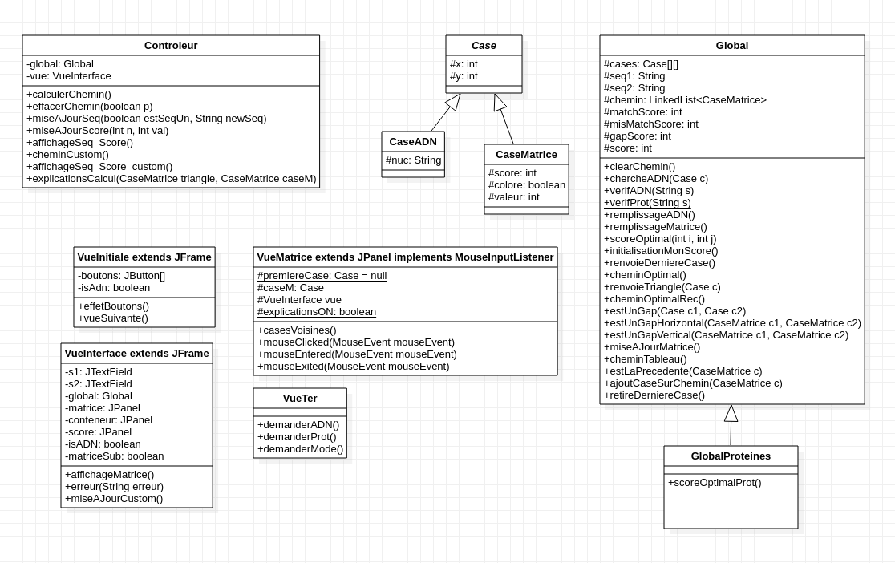

README - Projet de programmation PI4 2021/2022  
**AR1 - Alignement de séquences**  
==============
<ins>Référente</ins> : Alice Roger  
<ins>Groupe J</ins> : Dounia BENYAKHLAF, Linéa DESARBRE, Louise LAM, Elvire TRAMA 



## Pour commencer
Ces instructions vont vous permettre d’obtenir une version fonctionnelle de notre projet d'alignement de séquences sur votre machine locale. Lisez les instructions suivantes pour une expérience optimale.

## Prérequis
Ce projet a été testé avec `SDK 15` et `Java Swing`. L’installation de cette version est recommandée pour pouvoir lancer le projet correctement.

## Installation
1. Décompresser le dépot du projet depuis le répertoire parent. Dans une console UNIX, utiliser la commande suivante :
```
tar xf projet-prog.tar
```  

2. Se placer dans le répertoire src de projet-prog : 
```
cd projet-prog/src/
```

3. Copier le chemin de la matrice protéique obtenu par la commande :
```
readlink -f Modele/matriceProt.csv
```

4. Compiler le projet à l'aide de la commande :
```
javac */*.java
```

5. Exécuter le projet à l'aide de la commande :
```
java Vue.VueInterface coller/le/path/copié/en/3
```

## Voir le fichier [RAPPORT](RAPPORT.md) pour plus d’informations concernant la construction du projet.

